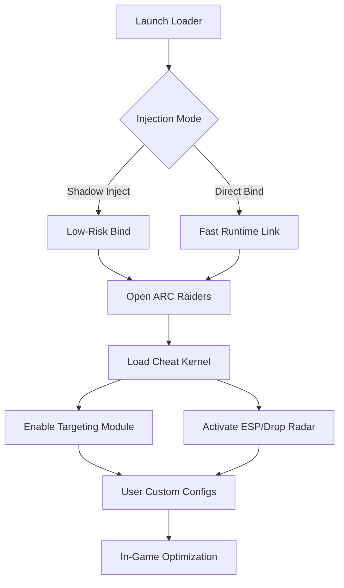

# ARC Raiders Private Cheat 

A private build refined for those who prefer to move unseen yet strike with certainty.
This software doesn’t shout; it simply enhances your perception, sharpens your timing,
and lets you navigate ARC Raiders’ chaos with almost lyrical confidence.

---

## 🌐 Overview

ARC Raiders is a world of metallic storms and relentless ambushes. This private cheat steps in as a tactical augmentation system—quiet, stable, and deeply configurable. With precision-based targeting modules, adaptive vision overlays, and item-tracking awareness, it molds the battlefield into something readable and navigable.

[!IMPORTANT]
This tool is focused on customization, allowing players to craft their preferred intensity—from gentle assist to aggressive tactical support.

---

## 🎯 Features

### Precision Targeting Module

A flexible auto-aim/precision-lock system letting you choose how subtle or strong your adjustments should be.

* Adjustable aim smoothing
* Per-weapon sensitivity curves
* Dynamic target switching
* FOV-based engagement zones

### Vision Suite (ESP / Wall Vision)

Your eyes expand—foes, loot, containers, and threats glow with interpretive clarity.

* Enemy outlines with distance fade
* Item tier highlights
* Explosive/objective markers
* Visibility checker to avoid unnatural snapping

### Drop Radar & Item Tracker

The world whispers its riches:

* Floor loot indicators
* High-value drop beacons
* Rare item pulsers
* Configurable filters for clutter control

### Stealth Core

A private build with:

* Encrypted injection
* Minimal CPU footprint
* Randomized runtime IDs
* Anti-trace cleanup routines

---

## 🪟 Compatibility

| Component        | Supported | Notes                |
| ---------------- | --------- | -------------------- |
| Windows 10/11    | ✔️        | Optimized for 21H2+  |
| ARC Raiders (PC) | ✔️        | Current season ready |
| Steam Version    | ✔️        | Auto-detect launcher |
| Epic Version     | ✔️        | Requires manual path |
| Controller Aim   | ✔️        | Custom analog curves |

[!NOTE]
Accessibility-friendly: all visuals, colors, and intensities can be adjusted for visibility comfort.

---

## ⚡ Setup Guide

1. **Download the private build**
   Place it anywhere outside the ARC Raiders directory.

2. **Run the loader as Admin**
   The tool calibrates hardware ID silently.

3. **Select Injection Mode**

   * *Shadow Inject (safe)*
   * *Direct Bind (fast)*

4. **Launch ARC Raiders**
   The menu opens via:

   ```
   CTRL + ARROW UP
   ```

5. **Configure your modules**
   Try these example values:

   ```json
   {
     "aim_smooth": 7.5,
     "fov": 38,
     "esp_range": 280,
     "loot_filter": ["Rare", "Epic", "Quest"]
   }
   ```

---

## 📊 System Flow (Mermaid Diagram)



---

## ❓ FAQ

### **Is this detectable?**

The build uses modular spoofing and runtime randomization, but detection risks always exist. Stay updated and avoid extreme settings.

### **Can I use it on low-end PCs?**

Yes—disable advanced outlines and reduce range to lighten GPU draw.

### **Does the tool affect FPS?**

Only minimally. ESP layers use adaptive draw cycles to remain lightweight.

### **Where are configs stored?**

In encrypted `.arcprofile` containers inside your Documents folder.

### **How often are updates released?**

Typically after major ARC Raiders patches or engine shifts—incremental hotfixes roll out automatically.

---

## 🔧 Advanced Config Examples

### Soft Assist (Natural Feel)

```
smooth = 12.0
aim_strength = 0.35
fov = 24
visibility_check = true
```

### Aggressive Tracking (High Pressure Zones)

```
smooth = 3.0
aim_strength = 0.85
fov = 55
target_switch = dynamic
```

### Minimalist ESP (Cleaner View)

```
enemy_boxes = true
enemy_bones = false
loot_tiers = ["Epic"]
distance_limit = 200
```

---

## ⭐ Final Thoughts

In the metallic storms of ARC Raiders, this private cheat becomes a quiet companion—
not loud, not reckless, but steady, like a whispered promise that you will see before others see you,
move before others strike, and claim what others miss.

Activate it, shape it, and let it guide your instincts.

---
